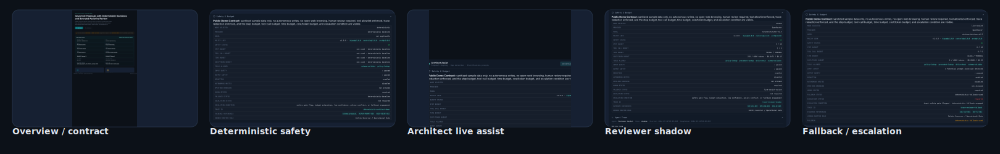

# Modern Literacy

**1 hub + 7 delivery repos**

Modern Literacy builds **AIDEN**, a **governed decision system with bounded agentic assistance** for AI system intake. The deterministic engine remains authoritative. Assistive agents help humans shape proposals and interpret evidence, but they do not replace the gate.

## Start Here
1. Open [`modern-literacy/aiden`](https://github.com/modern-literacy/aiden) for the architecture summary, repo map, and FPF view set.
2. Open [`modern-literacy/aiden-demo`](https://github.com/modern-literacy/aiden-demo) to see deterministic, shadow, and live-assist behavior with visible controls.
3. Open [`modern-literacy/aiden-engine`](https://github.com/modern-literacy/aiden-engine) to inspect contracts, policy lock refs, trace behavior, and the authoritative runtime.

## Repo map
- `aiden` — hub for architecture, intake, orchestration, and publication assets
- `aiden-engine` — deterministic decision core plus bounded assistive runtime
- `aiden-api` — schema-first .NET integration surface
- `aiden-demo` — public demo surface
- `aiden-tools` — review-pack, batch, and precedent tooling
- `aiden-policies-hipaa` — privacy / PHI policies
- `aiden-policies-controls` — transitional controls bundle
- `aiden-policies-arch` — architecture policies

## Modes
- **Deterministic** — authoritative baseline
- **Shadow** — bounded assistive comparison with no authority change
- **Live Assist** — visible bounded assistive path with fallback and escalation

## Responsible AI controls
- no autonomous writes
- no open-web browsing
- human review required
- tool allowlist enforced
- trace redaction enforced
- deterministic fallback available
- visible safety, budget, trace, and evidence surfaces

Security-sensitive concerns should follow the reporting path in [`SECURITY.md`](../SECURITY.md).
